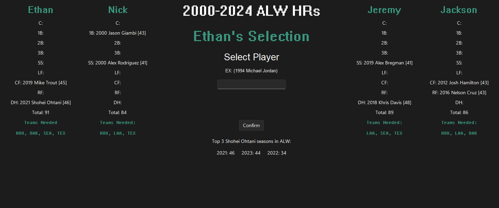
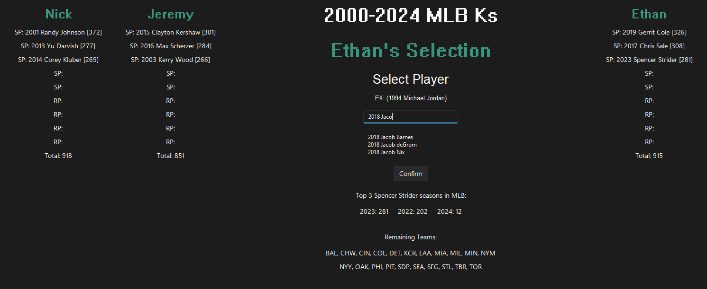

# Title
## Gamemodes

### Division
Players can only pick athletes from the selected division. \
Each player must pick at least one athlete from each franchise currently in the selected division. 

### Team Scarcity
Players can only pick athletes from the selected league (AL, NL, MLB). \
Once a player selects an athlete, their respective franchise cannot be used again. 

### Free for All:
Players can only pick athletes from the selected league (AL, NL, MLB). \
Players can select as many athletes from the same franchise as they want.

