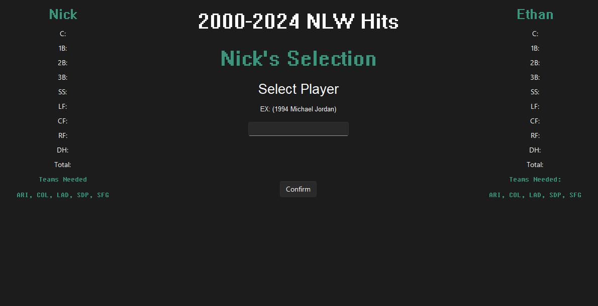
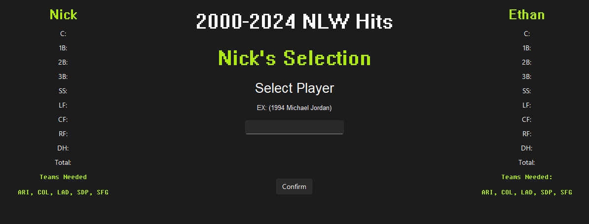

# Title
## Gamemodes

### Division
Pick an athlete from a single season. \
Players can only pick athletes from the selected division. \
Each player must pick at least one athlete from each franchise currently in the selected division. 

### Team Scarcity
Pick an athlete from a single season. \
Players can only pick athletes from the selected league (AL, NL, MLB). \
Once a player selects an athlete, their respective franchise cannot be used again. 

### Free for All:
Pick an athlete from a single season. \
Players can only pick athletes from the selected league (AL, NL, MLB). \
Players can select as many athletes from the same franchise as they want.

## Themes
Themes are powered by [sv_ttk](https://github.com/rdbende/Sun-Valley-ttk-theme)

### Light Mode

### Dark Mode

## Color Options

### Ocean

### Ruby

### Spooky

### Rose

### Lime

### Tulip

